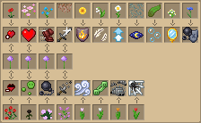

# Floral Alchemy
**Revamps brewing mechanics with... flowers?**

## Features
- **Brewing Stand**: Now crafted with a **Copper Ingot** instead of a Blaze Rod.
- **Honeycomb**: Acts as **brewing fuel**, replacing Blaze Powder.
- **Potion Stacking**: Potions now stack up to **16**.
- **Gunpowder & Dragon's Breath**: Still used for **Splash** and **Lingering** potions.
- **New Potion Modifiers**:
    - **Sugar** increases potion **duration**.
    - **Main Ingredient** increases potion **strength**.

## Revamped Potion Recipes
Potion crafting now centers around flowers! Brewing **Awkward Potion** now uses a **Dandelion** as its base.

## Feedback
Found a bug or got some suggestions, head over to [GitHub Issues](https://github.com/q4niel/Floral-Alchemy/issues).
