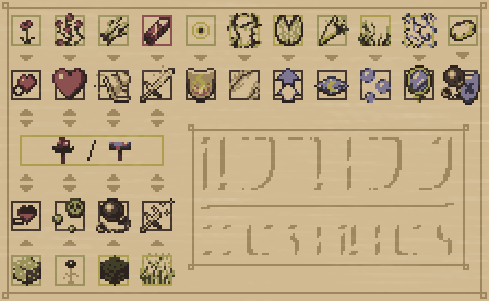

# Nature's Cauldron
**Making Brewing Actually Enjoyable**

## Features
- **Brewing Stand**: Now crafted with a **Copper Ingot** instead of a Blaze Rod.
- **Charcoal**: Acts as **brewing fuel**, replacing Blaze Powder.
- **Potion Stacking**: Potions now stack up to **16**.
- **Gunpowder & Dragon's Breath**: Still used for **Splash** and **Lingering** potions.
- **New Potion Modifiers**:
    - **Sugar** increases potion **duration**.
    - **Main Ingredient** increases potion **strength**.

## Revamped Potion Recipes
**Awkward Potion** brewing now uses either a **Red Mushroom** or a **Brown Mushroom** as its base ingredient.

## **Credits**
- **Art Assets** created by **Max Westerlund**.

## Feedback
Found a bug or got some suggestions, head over to [GitHub Issues](https://github.com/q4niel/Natures-Cauldron/issues).